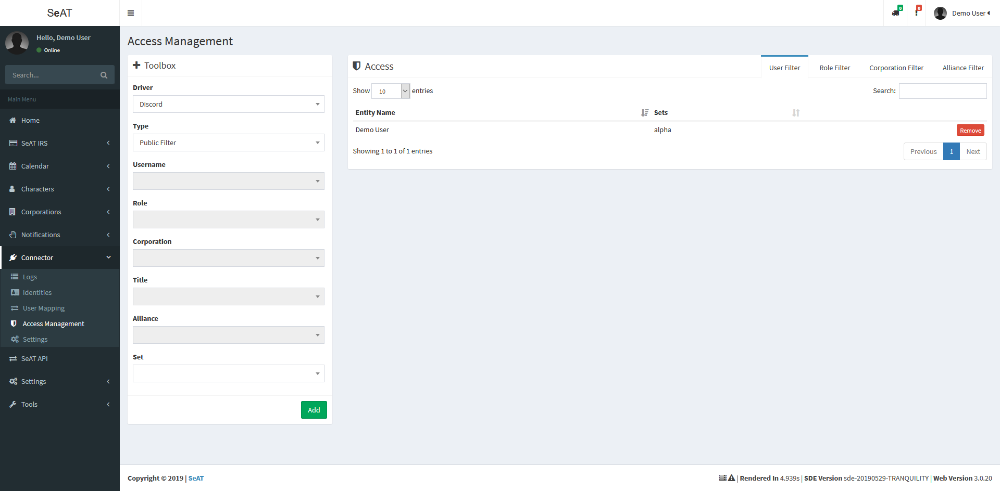
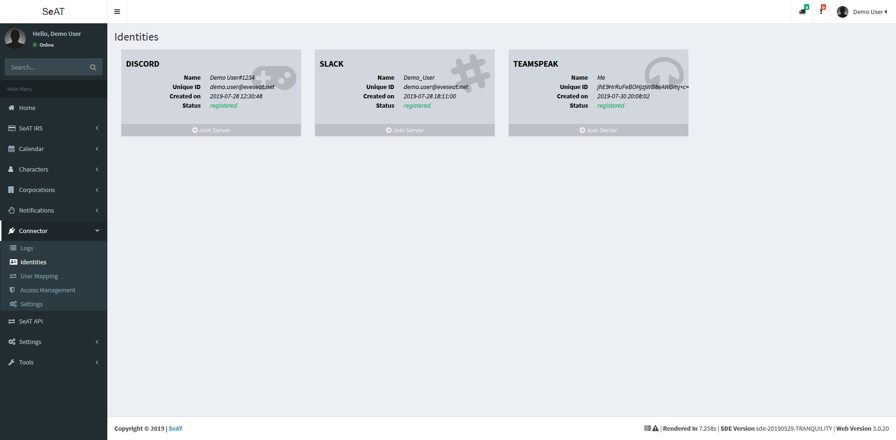
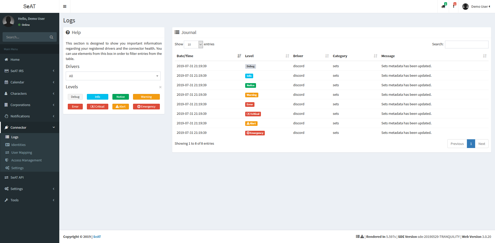
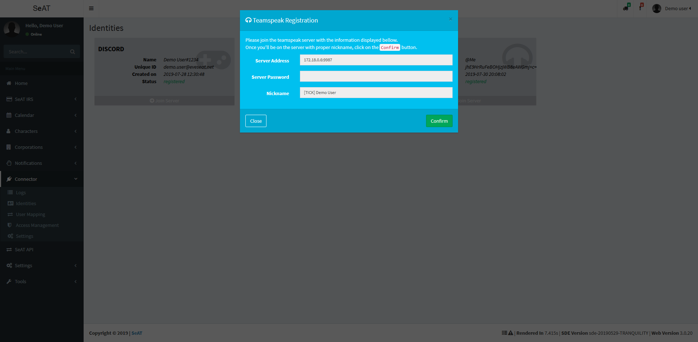
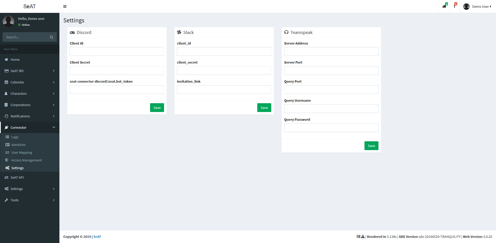
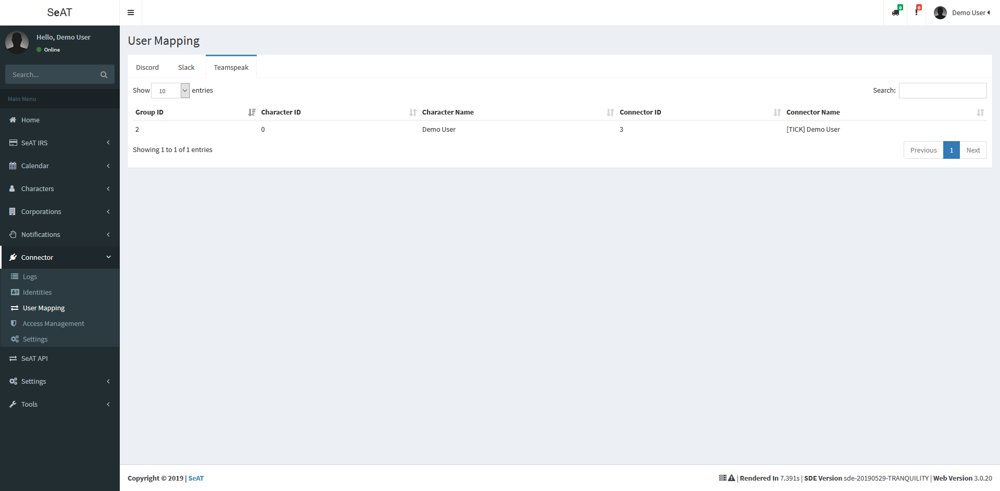
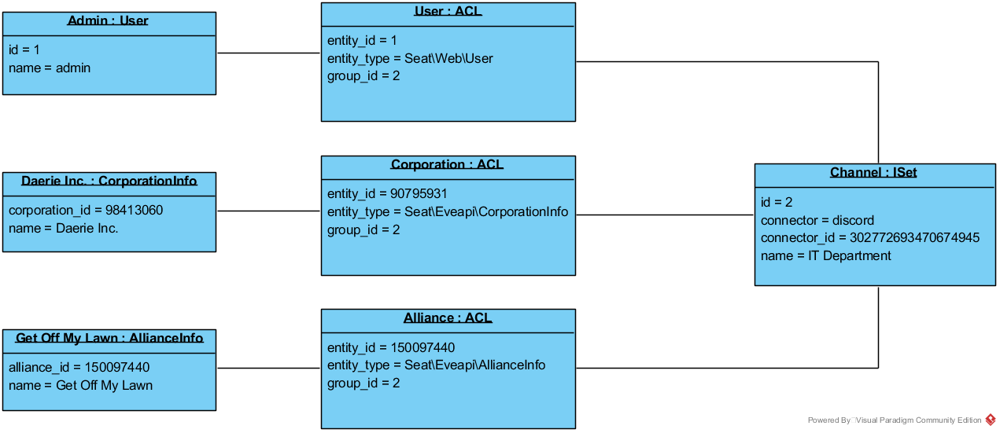

# SeAT-Connector
Provide basic layer for SeAT connectors

# Preview

The universal SeAT Connector Layer provider a single point of access for both your users and staff.
You can manage users, policies, logs and everything for the same plugin and it will be maintain the same way on all platforms.

# Drivers

You'll find bellow all supported platforms

| Platform      | Latest Version                                                                                                 | Maintainer     | Composer Chain                  | Repository                                               |
| ------------- | -------------------------------------------------------------------------------------------------------------- | -------------- | ------------------------------- | -------------------------------------------------------- |
| **Teamspeak** |          | Warlof Tutsimo | `warlof/seat-teamspeak:dev-seat-connector`         | [view](https://github.com/warlof/seat-teamspeak)         |
| **Discord**   |  | Warlof Tutsimo | `warlof/seat-discord-connector:dev-seat-connector` | [view](https://github.com/warlof/seat-discord-connector) |
| **Slack**     |                | Warlof Tutsimo | `warlof/slackbot:dev-seat-connector`               | [view](https://github.com/warlof/slackbot)               |

# Installation

To use this plugin, you need at least one driver as it's only provide business logic for policy and UI.
The connector can be install using `composer require warlof/seat-connector --update-no-dev`
Any driver can be install using `composer require {composer chain} --update-no-dev`

You can add and/or remove drivers at any time.

# Commands

The connector is shipped with two commands :

 - `seat-connector:sync:sets` will refresh driver sets known by SeAT (by default, it will refresh sets for all drivers - you can specify driver using `--driver` argument)
 - `seat-connector:apply:policies` will apply specified policy (by default, it will apply policy on all drivers - you can specify driver using `--driver` argument)

# Structure

Build your own [driver](./docs/ImplementDriver.md)
